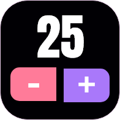

# Counter App
This is a basic Counter app.
## Built With 🛠
* [Kotlin] - First class and official programming language for Android development.
* [ViewModel] - Stores UI-related data that isn't destroyed on UI changes.

## App Icon 📱

[Kotlin]: https://kotlinlang.org/
[ViewModel]: https://developer.android.com/topic/libraries/architecture/viewmodel
